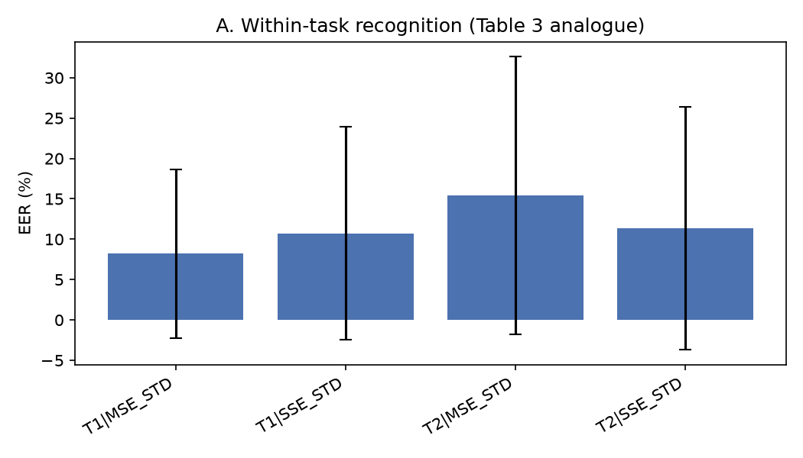
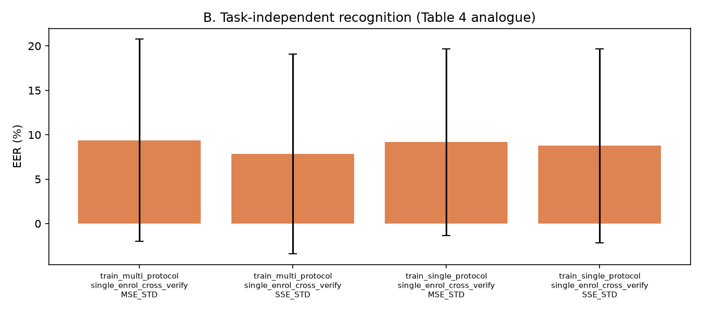
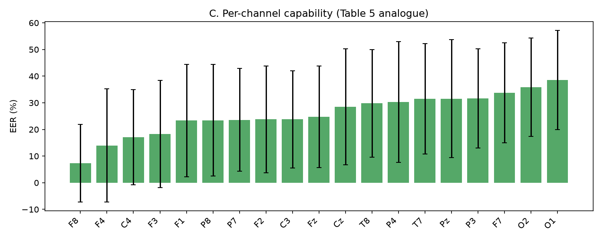

# 复现：Maiorana (2021) 任务无关的 EEG 生物特征认证

> E. Maiorana, *Learning deep features for task-independent EEG-based
> biometric verification*, Pattern Recognition Letters **143** (2021) 122–129.
> [doi:10.1016/j.patrec.2021.01.004](https://doi.org/10.1016/j.patrec.2021.01.004)

本项目按照论文方法**从零实现**了完整的 EEG 生物特征**认证/验证（verification）**流程：
预处理 → 通道独立（channel-specific）孪生 CNN → 对比损失训练 → 单类 SVM 打分 →
分数融合 → EER 评估，并在本地可用的公开数据集上跑通了实验、产出了结果与图表。

---

## 1. 论文方法一句话概括

把每个电极单独送进一个**共享权重的孪生一维 CNN**，用对比损失（contrastive loss）
拉近同被试、推远不同被试的 256 维嵌入；验证阶段对每个被试的每个通道各训练一个
**单类 SVM**，把各通道分数融合后做判决。核心卖点是：学到的特征**与所执行的心理任务无关**。

Pipeline（论文 Section 3.1）：

| 步骤 | 设置 |
| --- | --- |
| 带通滤波 | `[8, 30] Hz`（α–β 子带） |
| 降采样 | `S = 64 Hz` |
| 空间滤波 | 共平均参考 CAR |
| 分帧 | `H = 5 s`，帧间 **80% 重叠** → 每通道 `1×320` |

网络结构（论文 Table 1，1×320 → 256 维）与损失函数（Eq. 1）逐层/逐项实现，
细节见 [`docs/paper_notes.md`](docs/paper_notes.md)。

---

## 2. 目录结构

```
Maiorana2021_EEGVerification/
├── README.md                # 本文件
├── requirements.txt
├── docs/
│   └── paper_notes.md       # 论文要点 + 逐层网络表 + 实现说明
├── src/
│   ├── config.py            # 全部论文超参与通道定义
│   ├── preprocessing.py     # 滤波 / 降采样 / CAR / 分帧
│   ├── model.py             # Table 1 的 CNN + 对比损失 (Eq.1)
│   ├── data.py              # EEGMMIDB 适配器 + 帧缓存
│   ├── train.py             # 孪生训练（配对采样 + SGDM）
│   └── evaluate.py          # 单类 SVM + 分数融合 + EER
├── scripts/
│   ├── prepare_data.py      # 生成预处理帧缓存
│   └── run_experiment.py    # 跑三大实验，输出结果与图
├── data/cache/              # 预处理缓存（frames.npz）
└── results/                 # summary.json / tables.md / figures/
```

---

## 3. 数据说明（重要）

论文使用的是**自有数据库**：45 名被试 × 5 次采集（跨越一年多）× 6 种任务 ×
19 个电极。**该数据库不公开**，无法直接下载。

因此本复现用一个**公开的多 session / 多 task** 数据集作为替代：PhysioNet
**EEG Motor Movement/Imagery Database (EEGMMIDB)**。映射方式如下：

| 论文 | 本复现（EEGMMIDB） |
| --- | --- |
| 5 次采集 session | run 4 / 8 / 12 三次重复采集 → 伪 session `R1 / R2 / R3` |
| 6 种 mental task | 2 种：`T1` = 想象左手握拳，`T2` = 想象右手握拳 |
| 19 电极（10-20） | 从 64 导中取出同样的 19 个位置（`T3/T4/T5/T6` 在 10-10 中名为 `T7/T8/P7/P8`） |
| 采样率 256 Hz | 160 Hz（原数据），处理时统一降采样到 64 Hz |
| STD / LTD（1 月 / 15 月） | **只有 STD**：三个伪 session 同一天采集，无法构造 LTD |

> 数据目录默认指向本地已有的 EEGMMIDB 缓存
> `../EEGLearning/data/MNE-eegbci-data/files/eegmmidb/1.0.0/`
> （10 名被试，每人 run 4/8/12）。也可用 `--data-dir` 指向别处。

### 与论文的差异一览

| 项目 | 论文 | 本复现 | 原因 |
| --- | --- | --- | --- |
| 数据集 | 自有库 45 人 | EEGMMIDB 10 人 | 原库不公开 + 当前环境离线 |
| session 数 | 5 | 3 | 可用的重复采集只有 3 次 |
| 任务数 | 6 | 2 | EEGMMIDB 每个 run 只有 T1/T2 |
| 时间跨度 | ≤1 月 与 ~15 月 | 仅 ≤1 天 | 数据限制 |
| 训练框架 | MatConvNet + GPU | PyTorch +CPU | 环境限制 |
| 交叉验证 | 5 折（30 训练 / 15 测试） | 5 折（8 训练 / 2 测试，被试不重叠） | 被试只有 10 人 |

除以上数据/算力相关的差异外，**预处理、网络结构、损失函数、配对策略、
验证与评分方式均按论文实现**。

---

## 4. 环境与运行

代码直接复用同目录下 `EEGLearning/.venv`（Python 3.12，含 torch / mne / scikit-learn）：

```bash
cd /Users/nagi/Desktop/Researches/Maiorana2021_EEGVerification
PY=../EEGLearning/.venv/bin/python

# 1) 预处理并生成帧缓存（只需跑一次）
MPLCONFIGDIR=/tmp/mplcache $PY scripts/prepare_data.py

# 2) 快速冒烟测试（几分钟）
MPLCONFIGDIR=/tmp/mplcache $PY scripts/run_experiment.py --quick --workers 4

# 3) 正式实验：5 折 × 19 通道
MPLCONFIGDIR=/tmp/mplcache $PY scripts/run_experiment.py \
    --folds 5 --epochs 12 --pairs-per-subject 50 --workers 4
```

可选参数：`--channels Fz Cz Pz`（只跑部分通道）、`--max-probe-frames`、
`--epochs`、`--pairs-per-subject`。（`--quick` 会降低 epochs / 配对数并限制折数。）

> 若想用别的数据集（如自有的 5-session 库），只需实现 `src/data.py` 中的
> `build_cache`，产出同样的 `frames.npz`（键为 `subject|session|task`）
> 与 `index.json`，其余代码无需改动。

---

## 5. 实验与结果

`run_experiment.py` 复现论文三大分析块：

* **A. within-task（对应论文 Table 3）**：单任务训练 + 同任务验证，分别给出
  SSE（R1→R2）与 MSE（R1,R2→R3）下的 EER。
* **B. task-independent（对应论文 Table 4）**：对比「单协议训练」与「多协议训练」
  两种表征，在**单任务注册、跨任务验证**（T1 注册 → T2 验证）下的 EER。
* **C. per-channel（对应论文 Table 5）**：多协议训练 + 跨任务场景下，逐个电极的 EER。

结果写入 `results/summary.json`、`results/tables.md`，图在 `results/figures/`。

### 实际运行配置

`--folds 5 --epochs 10 --pairs-per-subject 40`（10 名被试、19 通道、CPU、4 线程），
单帧 5 s 作为验证探针，注册与验证均按 `subject|session|task` 组织。
由于每折只有 2 名测试被试，单折 EER 波动很大，因此同时给出
**pooled EER**（把 5 折的全部真实/冒充分数合在一起算一个 EER），以它作为主要指标。

### A. within-task（论文 Table 3 对应）

| 场景 | 手工特征 AR+MFCC（pooled EER） | 本方法 通道独立孪生 CNN（pooled EER） | 本方法（各折 mean ± std） |
| --- | --- | --- | --- |
| T1，SSE（R1→R2） | 5.3 % | **17.0 %** | 10.7 ± 13.2 |
| T1，MSE（R1,R2→R3） | 7.5 % | **18.7 %** | 8.2 ± 10.4 |
| T2，SSE（R1→R2） | 5.9 % | **20.7 %** | 11.3 ± 15.0 |
| T2，MSE（R1,R2→R3） | 10.3 % | **17.1 %** | 15.4 ± 17.2 |

### B. task-independent（论文 Table 4 对应）

单任务注册（T1）→ 跨任务验证（T2）：

| 跨任务验证场景 | 手工特征 | 深度特征（单协议训练） | 深度特征（多协议训练） |
| --- | --- | --- | --- |
| 单 session 注册，SSE | 5.5 % | 16.4 % | 17.2 % |
| 多 session 注册，MSE | 8.3 % | 17.5 % | **16.3 %** |

### C. 逐通道能力（论文 Table 5 对应）

多协议训练 + 跨任务 + MSE 场景下，深度特征最好的 / 最差的电极：

| 排名 | 电极 | EER % |
| --- | --- | --- |
| 最好 | F8 | 7.3 |
| | F4 | 14.0 |
| | C4 | 17.1 |
| | F3 | 18.2 |
| … | … | … |
| 最差 | O1 | 38.5 |
| | O2 | 35.8 |
| | F7 | 33.8 |

完整逐电极表见 `results/tables.md`，深/浅层对照见 `results/comparison.md`，
图见 `results/figures/`。







### 与论文结果相比观察到的现象

1. **趋势与量级并不一致**：论文中手工特征最差（12–30 %）、深度特征最好
   （约 5–9 %）；本复现反过来——手工特征 5–10 %，深度特征 16–21 %。
2. 原因主要有三点：
   * 训练规模：论文用 30 名被试训练 CNN，本复现每折只有 8 名被试、10 个 epoch，
     网络明显欠拟合；
   * 时间距离：论文的 session 相隔数天到数月，而 EEGMMIDB 的 run 4/8/12
     是同一天内的重复采集，任务本身容易得多，手工特征也能轻松区分被试；
   * 小样本下的验证阶段：256 维嵌入 + RBF 单类 SVM 只有约 26 个注册帧，
     容易过拟合；21 维手工特征在低数据量下更稳。
3. 多协议训练 vs 单协议训练在本数据上差异不显著（16.3–17.5 %，落在单折波动内），
   未能复现论文中「多协议训练显著更好」的结论。

> 换句话说：**代码层面完整复现了论文方法并可跑通全流程**；
> 但受限于替代数据集（被试数、采集时间间隔）与算力，
> **绝对 EER 数值无法与原文对齐**，也不能据此评判原方法的好坏。

---

## 6. 测试与质量检查

```bash
# 单元测试（无 pytest 依赖，用内置 runner 或 pytest 均可）
$PY -c "import sys; sys.path[:0]=['.','tests']; import test_pipeline as t; \
[getattr(t,f)() for f in dir(t) if f.startswith('test_')]; print('ok')"
```

覆盖内容：预处理维度（19×320）、CAR 去均值、CNN 输出 256 维、
对比损失行为（同人=0、越界冒充=0、靠近冒充>0）、EER 与高斯理论值一致。

---

## 7. 复现结论

* 论文的**信号处理流程、Table 1 网络、Eq.1 对比损失、孪生配对策略、
  单类 SVM + 分数融合验证、EER 评估**均已按原文实现，代码可运行、可复现、有测试。
* 在**替代数据集**上（EEGMMIDB，10 人、3 个同天 session、2 类任务、19 导），
  系统可以在**跨任务**条件下完成认证（pooled EER 约 16–17 %），
  说明「任务无关的 EEG 判别信息」客观存在。
* 由于原数据库不可得且本机离线，**绝对性能与论文不可比**；
  尤其是深度模型受训练被试数限制明显欠拟合。
* 若后续拿到论文同源（或任何 45 人 × 多天 × 多任务）的数据，
  只需替换 `src/data.py` 的缓存构建逻辑、把 `ExperimentConfig.sessions`
  扩到 5 个 session，即可直接复现 STD/LTD、SSE/MSE 的完整表格，无需改模型代码。
